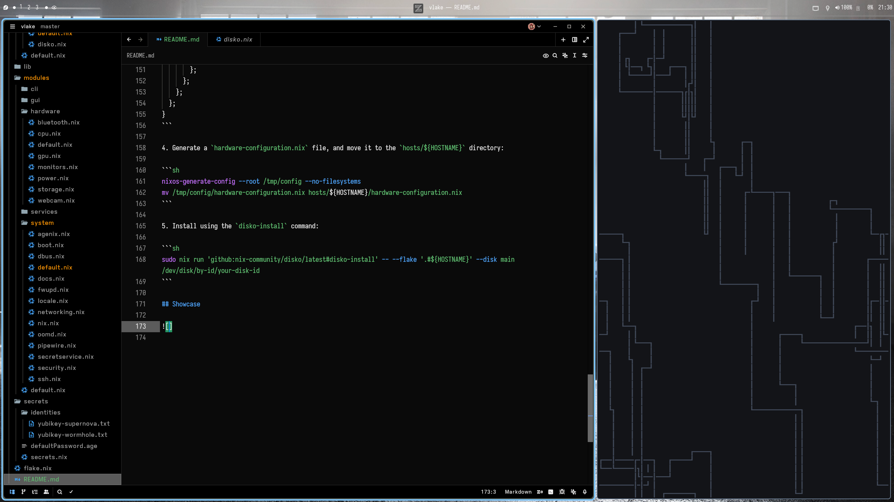

<h1 id="header" align="center">
	
	<br/>
	vlake
</h1>

> [!CAUTION]
> This is very work-in-progress!
> I am not a Nix expert, this is just my effort to make a working flake for my personal use.
> No guarantees are made about this flake working on any system other than my own!

## Table of Contents

- [Table of Contents](#table-of-contents)
- [Introduction](#introduction)
- [Hosts](#hosts)
- [Structure](#structure)
- [Usage](#usage)
- [Showcase](#showcase)
- [Challenges](#challenges)
- [To-Do](#to-do)
- [Credits](#credits)
- [License](#license)

## Introduction

**vlake** (Victor's Flake, original, I know), is primarily a personal NixOS configuration. It's built entirely around nixos modules (true modules, not importing files with static configurations), with the modules focused on being flexible enough for my personal use, without being overly verbose. The reason for having overly specific modules is to allow a machines configuration to be in a single file, without the level of complexity of a configuration.nix.

I'm not going to pretend that this is a perfect flake, or entirely original work (check out the [Credits](#credits)), but if its enough to get stuff working, that's all that matters!

### Key Considerations:

- **Usability:** I do not want to have to go in and make modifications regularly just to get basic functionality working!
- **Simplicity:** Nothing is supposed to be overly complicated, simplicity is preferred where possible (a big reason for choosing [Hjem](https://github.com/feel-co/hjem) over Home-Manager).
- **No "Over-nixxing":** Modular enough to work for my use-cases, but not allowing Nix to get in the way of dynamic user-configuration (allowing programs like Matugen/Pywal to work).
- **Single-User:** Single-User only, no separation between user and system configuration.
- **Security:** Security by design, using Yubikeys where possible for presence factor authentication, and Agenix for secret management.

## Hosts

| Hostname  | Description                                                                                    | Specs                                                                                       | Type    | Arch           | Implemented |
| --------- | ---------------------------------------------------------------------------------------------- | ------------------------------------------------------------------------------------------- | ------- | -------------- | ----------- |
| supernova | My Day-To-Day Desktop, primarily used for development of personal projects and gaming          | AMD Ryzen 7 5700X3D, 32GB RAM, NVIDIA GeForce RTX 3070, 1TB NVME SSD, 1TB SATA SSD, 2TB HDD | Desktop | x86_64-linux   | Yes         |
| wormhole  | My Laptop, primarily used for development on-the-go, research, web-browsing, documentation     | Dell XPS 13 Plus 9320, Intel Core i7-1360P, 16GB RAM, 512GB NVME SSD                        | Laptop  | x86_64-linux   | Yes         |
| quasar    | The server I use for hosting services for my family and friends.                               | HPE ProLiant DL380 Gen9, 2x Intel Xeon E5-2650v4, 128GB RAM, _no storage yet_               | Server  | x86_64-linux   | No          |
| blazar    | A Mac Mini, not really used for anything at the moment, trying to figure out a use-case for it | Apple M1, 8GB RAM, 256GB SSD                                                                | Desktop | aarch64-darwin | No          |
| comet     | A Raspberry Pi 4 that will be used for... something? eventually?                               | Broadcom BCM2711, 8GB RAM, _no storage yet_                                                 | Desktop | aarch64-linux  | No          |

## Structure

```
 hosts <- Per-Host Configurations.
├──  * <- Should be named after the hostname of the system.
│   ├──  default.nix <- Host configuration, basically a "configuration.nix" file.
│   ├──  disko.nix <- The disk configuration for a host.
│   └──  hardware-configuration.nix <- The autogenerated hardware configuration for a host.
└──  default.nix <- Contains the functions that set up the nixos configurations.
 lib
└──  default.nix <- Custom functions and utilities.
 modules <- Where the modules that make all this work go!
├──  cli <- These are the command-line configuration modules.
│   ├──  default.nix <- Provides some default options, and force enables required CLI modules.
├──  gui <- These are the graphical configuration modules.
│   ├──  default.nix  <- Provides some default options, and force enables required GUI modules.
├──  hardware <- These are the hardware-specific configuration modules (e.g. CPU, GPU, Monitors, etc.)
│   ├──  default.nix <- This *doesn't* contain any options or force enables any modules.
├──  services <- These are the service-specific configuration modules.
│   ├──  default.nix <- This *doesn't* contain any options or force enables any modules.
├──  system <- This contains the system-specific configuration modules.
│   ├──  default.nix <- Provides some default options, and force enables required system modules.
└──  default.nix <- Imports all the modules.
 secrets <- Contains the encrypted secrets for the system, and identity files.
├──  identities <- For hardware keys, identity files pointing to the hardware key must be present for agenix to reference.
│   ├──  yubikey-*.txt <- This file should be generated using age-plugin-yubikey.
├── 󰦝 *.age <- Age-encrypted secrets.
└──  secrets.nix <- The file for the agenix CLI to reference for secret management.
 flake.nix <- The main flake, containing all the inputs.
󰂺 README.md <- You are here!
```

## Usage

> [!NOTE]
> All commands should be run from the root of the repository.

1. Create a new host by creating a new directory named after the hostname of the system in the `hosts` directory.

```sh
mkdir hosts/${HOSTNAME}
```

2. Create a host configuration in the `default.nix` file:

```sh
touch hosts/${HOSTNAME}/default.nix
```

```nix
# MINIMUM HOST CONFIGURATION
_: {
  imports = [ ./disko.nix ./hardware-configuration.nix ];

  vlake = {
    system = {
      hostname = "supernova";
      username = "vvintorez";
      platform = "x86_64-linux";
    };
  };
}
```

3. Create a disko configuration in the `disko.nix` file:

```sh
touch hosts/${HOSTNAME}/disko.nix
```

```nix
# MINIMUM DISKO CONFIGURATION
{ inputs, ... }: {
  import = [ inputs.disko.nixosModules.disko ];

  disko.devices = {
	  disk = {
	    main = {
	      device = "/dev/disk/by-id/your-disk-id";
	      type = "disk";
	      content = {
	        type = "gpt";
	        partitions = {
	          ESP = {
	            type = "EF00";
	            size = "500M";
	            content = {
	              type = "filesystem";
	              format = "vfat";
	              mountpoint = "/boot";
	              mountOptions = [ "umask=0077" ];
	            };
	          };
	          root = {
	            size = "100%";
	            content = {
	              type = "filesystem";
	              format = "ext4";
	              mountpoint = "/";
	            };
	          };
	        };
	      };
	    };
		};
  };
}
```

4. Generate a `hardware-configuration.nix` file, and move it to the `hosts/${HOSTNAME}` directory:

```sh
nixos-generate-config --root /tmp/config --no-filesystems
mv /tmp/config/hardware-configuration.nix hosts/${HOSTNAME}/hardware-configuration.nix
```

5. Install using the `disko-install` command:

```sh
sudo nix run 'github:nix-community/disko/latest#disko-install' -- --flake '.#${HOSTNAME}' --disk main /dev/disk/by-id/your-disk-id
```

## Showcase

<div align="center">
	
</div>

## Challenges

#### Yubikeys:

TODO: Document Yubikey Challenges

## TODO:

- [ ] CLI Modules
- [ ] CLI Program Modules
- [ ] GUI Modules
- [ ] GUI Program Modules
- [ ] Service Modules
- [ ] Programming Language Modules

## Credits

### Cool People

- **[poz](https://poz.pet):** A large amount of my flake is based off [poz/niksos](https://git.poz.pet/poz/niksos), big props to poz for the inspiration, and being around to help me out!
- **[Esther](https://github.com/esther-ff):** Some cool stuff in [their flake](https://github.com/esther-ff/esthlake) including a simplified version of poz's createHosts function helped me with simplifying the process even further. Also thanks for being around to help out with nix lang stuff.
- **[NotAShelf](https://github.com/NotAShelf):** README heavily inspired by the formatting of the README in [their flake](https://github.com/NotAShelf/nyx).

- Special thanks to all the nerds in [Societal Issues Debate Club](https://societalissuesdebate.club) for existing!!

### Useful Resources

- **[MyNixOS](https://mynixos.com):** Probably the best place to search nixpkgs and explore NixOS options.
- **[NixOS Wiki](https://wiki.nixos.org/wiki/NixOS)**: The official NixOS wiki is a great resource for learning about NixOS, configuring the system, and programs.
- **[NixOS Discourse](https://discourse.nixos.org/)**: I've found many a fix, and helpful advice from the NixOS forums (especially with the more obscure topics like agenix + yubikeys).

### Super Useful Posts / Guides

- **[Getting the most out of your Yubikey on NixOS](https://joinemm.dev/blog/yubikey-nixos-guide):** A super useful guide to setting up PAM authentication for system auth, and other useful Yubikey features.
- **[Step Up Your SSH Game: A Deep Dive into FIDO2 Hardware Keys and ProxyJump Configuration](https://weisser-zwerg.dev/posts/openssh-fido2-hardwarekey/):** A super useful guide to setting up FIDO2 hardware keys for SSH authentication.
- **[Securing SSH Authentication with FIDO2](https://developers.yubico.com/SSH/Securing_SSH_with_FIDO2.html):** The official documentation for using Yubikeys for SSH authentication.
- **[Using SSH Resident Keys with a Yubikey 5](https://ilanjoselevich.com/blog/using-ssh-resident-keys-with-a-yubikey-5/):** Simple guide to the different setups for additional authentication factor setup when generating FIDO2 SSH keys.

## License

Except specific files which bear a different license, this project is licensed under the EUPL-1.2 or later.

This license requires attribution for reuse or derivitave works: Please be sure to credit if you use anything from this flake, with at least a link to the repository: [https://github.com/victorvintorez/vlake](https://github.com/victorvintorez/vlake).
